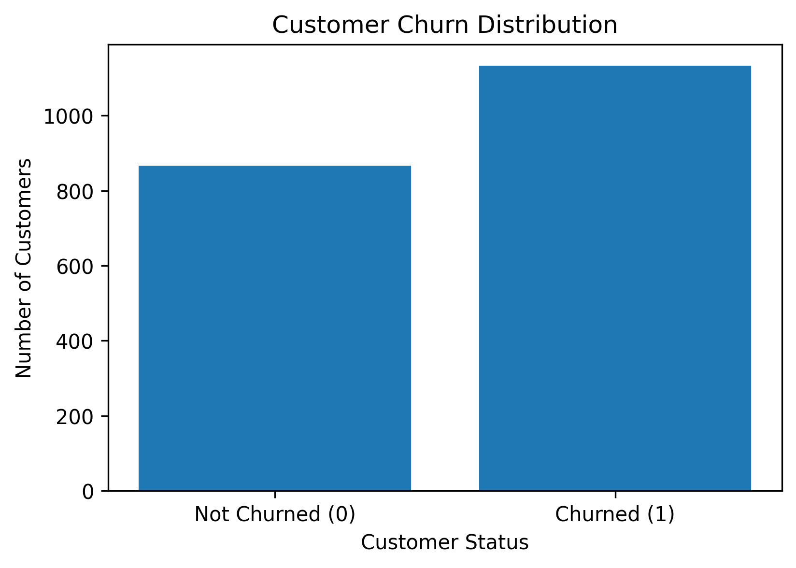

# Customer Churn Analysis & Prediction

## Project Overview

This project analyzes customer churn using exploratory data analysis (EDA) and machine learning techniques.

The objective is to identify important factors associated with customer churn and build a machine learning model to predict customers who may be at risk of leaving.

## Objectives

- Analyze customer behavior and churn patterns
- Identify factors associated with customer churn
- Perform exploratory data analysis (EDA)
- Calculate and visualize churn rates
- Analyze relationships between numerical variables
- Build and compare machine learning classification models
- Evaluate models using Accuracy and ROC-AUC
- Identify important features influencing churn
- Provide actionable business recommendations

## Technologies Used

- Python
- Pandas
- NumPy
- Matplotlib
- Seaborn
- Scikit-learn
- Google Colab
- Jupyter Notebook

## Machine Learning Models

The following classification models were tested:

1. Logistic Regression
2. Scaled Logistic Regression
3. Random Forest

### Best Model

**Logistic Regression**

- Accuracy: **57.25%**
- ROC-AUC: **0.600**

The analysis identified `LastPurchaseDaysAgo` as the most influential feature in the Logistic Regression model.

## Key Business Insights

- Overall customer churn rate: **56.65%**
- Highest churn age group: **36–45 years (60.26%)**
- Highest churn membership group: **0–6 months (58.62%)**
- Highest churn recency group: **91–180 days (63.43%)**
- Highest churn discount group: **51–75% (57.79%)**
- Most influential feature: **LastPurchaseDaysAgo**

## Business Recommendations

1. **Target customers with long purchase gaps**  
   Use personalized offers, reminders, and re-engagement campaigns for customers who have not purchased for a long period.

2. **Focus on new members**  
   Improve onboarding, provide early-stage support, and offer incentives during the first few months.

3. **Monitor customers aged 36–45**  
   Use targeted loyalty programs and personalized communication to improve retention.

4. **Improve customer support**  
   Identify customers with repeated support issues and resolve their problems quickly.

5. **Use purchase recency as an early warning signal**  
   Customers with long periods since their last purchase should be prioritized for retention campaigns.

## Project Outcome

This project demonstrates how Python, data analysis, visualization, and machine learning can be used to transform customer data into actionable business insights and build a basic customer churn prediction model.

## Files

- `Customer_Churn_Analysis.ipynb` — Complete analysis and machine learning notebook
- `customer_churn (1).csv` — Dataset used for the analysis

## Author

**Amar Mayengbam**
## Key Results

- Overall customer churn rate: **56.65%**
- Best performing model: **Logistic Regression**
- Model accuracy: **57.25%**
- ROC-AUC: **0.600**
- Most influential feature: **LastPurchaseDaysAgo**
- Highest churn age group: **36–45 years (60.26%)**
- Highest churn membership group: **0–6 months (58.62%)**
- Highest churn recency group: **91–180 days (63.43%)**

## Customer Churn Distribution

## Business Recommendations

1. Target customers with long purchase gaps using personalized offers and re-engagement campaigns.
2. Improve onboarding and early-stage support for new members.
3. Use targeted loyalty programs for customers aged 36–45.
4. Address repeated customer support issues quickly.
5. Use purchase recency as an early warning signal for potential churn.

## Project Outcome

This project demonstrates how Python, Pandas, Matplotlib, Seaborn, and Scikit-learn can be used to analyze customer churn, identify important customer behavior patterns, and build a basic machine-learning prediction model.
